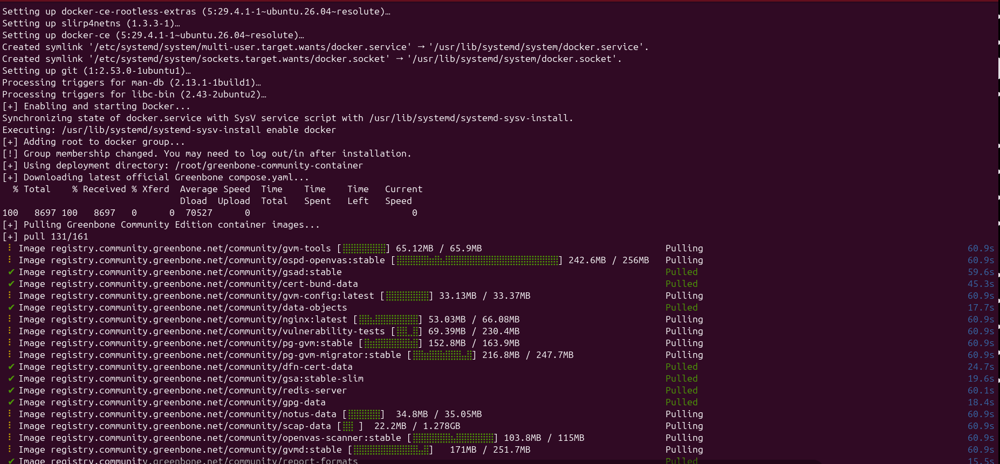
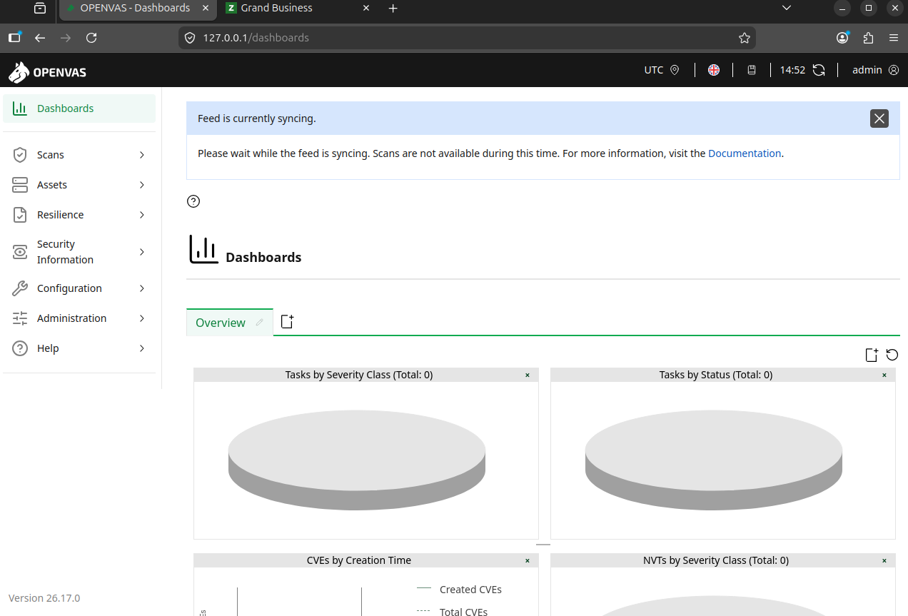
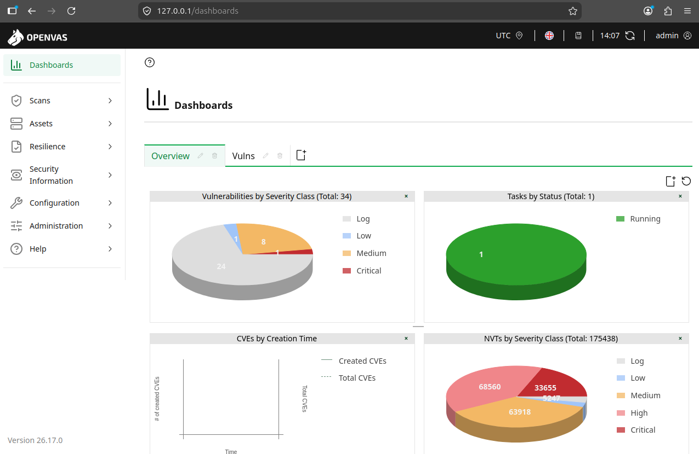

# Openvas-Seven

Automated deployment of **Greenbone Community Edition (OpenVAS)** using Docker on modern Ubuntu environments.

This project was updated to support recent Ubuntu versions and simplify the full installation flow, including:

- Docker installation and service activation  
- Greenbone Community Edition deployment  
- Feed synchronization monitoring  
- Initial access preparation  
- Operational validation after first startup  

---

# Features

- Automated installation for modern Ubuntu environments  
- Official Greenbone Community Edition deployment using Docker  
- Automatic compose file retrieval  
- Feed synchronization support  
- Additional monitoring script included (`sync_status.sh`)  
- Practical first-start troubleshooting  

---

# Included Files

```bash
Openvas_Seven.sh
sync_status.sh
README.md
```

---

# Installation

Clone the repository:

```bash
git clone https://github.com/sayseven7/Openvas-Seven.git
cd Openvas-Seven
chmod +x Openvas_Seven.sh
sudo ./Openvas_Seven.sh
```

---

# Custom Password (Optional)

You can define the admin password before installation:

```bash
sudo GVM_ADMIN_PASSWORD='YourStrongPassword' ./Openvas_Seven.sh
```

If omitted, Greenbone generates a random password automatically during first startup.

---

# Feed Synchronization Monitoring

The first startup may take several minutes because Greenbone needs to load:

- CERT data  
- CPE data  
- CVE database  
- VT database  

Use:

```bash
chmod +x sync_status.sh
./sync_status.sh --path /root/greenbone-community-container
```

Or:

```bash
./sync_status.sh --summary --path /root/greenbone-community-container
```

---

# First Startup Behavior

During first startup the web interface may display:

> Feed is currently syncing

This is expected.

Scans become fully available after synchronization finishes.

---

# Screenshots

## Deployment



Automated download and container preparation using Docker.

---

## Feed Synchronization



Initial feed loading phase where Greenbone imports CVEs, CERTs and scanner plugins.

---

## Operational Dashboard



Environment fully operational after synchronization, with NVT database loaded and scans available.

---

# Default Access

```text
URL: http://127.0.0.1
User: admin
```

Password is generated during first startup if not manually defined.

---

# Notes

- First synchronization can take 20 to 40 minutes depending on hardware and network.
- Running as root may deploy files under:

```bash
/root/greenbone-community-container
```

- Running as user may deploy under:

```bash
/home/<user>/greenbone-community-container
```

---

# Recommended Topics

```text
openvas
greenbone
docker
ubuntu
vulnerability-scanner
security-tools
cybersecurity
automation
bash
```

---

# Author

Lucas Morais (SaySeven / @sayseven7)
